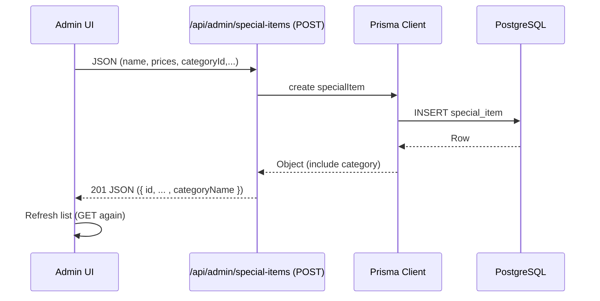
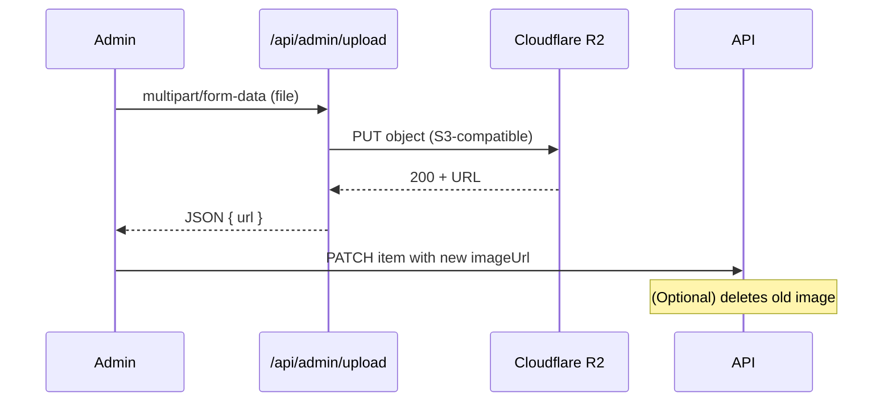

# Architecture

## System Context

```
+------------------+           +-------------------------+
| End User Browser |  <----->  |  Next.js (App Router)   |
+------------------+           |  - Pages / Components   |
                                |  - API Routes          |
                                +-----------+------------+
                                            |
                                            v
                                +-------------------------+
                                | Prisma ORM (Node client)|
                                +-----------+-------------+
                                            |
                                            v
                                +-------------------------+
                                | PostgreSQL Database     |
                                +-------------------------+
                                            |
                                            v
                                +-------------------------+
                                | Cloudflare R2 (Images)  |
                                +-------------------------+
```

The application is a single-tenant (currently) Arabic RTL QR menu system with an admin panel. All public data (store, categories, items, specials) is rendered server-side for: SEO, correctness of time-sensitive labels, and avoiding hydration flicker in theming.

## Layers & Responsibilities

| Layer | Responsibility | Notes |
|-------|----------------|-------|
| UI (Next.js Components) | Present data, capture user interactions | Client components isolated where interactivity / state needed (cart, admin forms) |
| API Routes | CRUD operations for store themes, items, specials, categories, uploads | JSON over HTTPS, loosely RESTful |
| Domain / Prisma | Data modeling and integrity, migrations | Explicit relations, minimal business logic in DB layer |
| Services / Lib (`/lib`) | Cross-cutting concerns (auth, links fallback, working hours, R2) | Pure / testable functions preferred |
| Storage (Postgres) | Durable state | Single database schema; future multi-tenant extension possible |
| Object Storage (R2) | Image assets | S3-compatible API with manual cleanup |

## Rendering Strategy

- Home page uses `export const dynamic = "force-dynamic"` to ensure each request recomputes time-sensitive open/close label & active specials.
- Theming and font attributes set via custom headers / root element attributes before hydration to avoid FOUC.
- Admin panel mostly client-side for responsive CRUD interactions.

## Data Fetch Flow (Home)

```
Request --> Next.js Server Component (page.tsx)
  ├─ Fetch Store (brand color, theme, font)
  ├─ Fetch Categories (ordered)
  ├─ Fetch Items (include category relation)
  ├─ Fetch Specials (time-eligible window)
  └─ Compose props -> <ClientHome />
       └─ Client-only UI (cart, tabs) consumes stable SSR arrays
```

## Working Hours & Hydration

Originally, computing the open label both server & client caused hydration mismatch when a minute flipped. Mitigation: prefer server snapshot (or memo) and optionally refresh client-side after mount on aligned minute cadence.

## State Management

- Cart: lightweight React context (`CartContext`) storing item references & calculator totals (not persisted).
- Forms: local component state only; no Redux or external store.

## Error Handling Strategy

| Area | Approach |
|------|----------|
| API Validation | Basic field presence checks; sends `{ error: string }` with HTTP 400+ |
| Upload Errors | Returns 500 + toast on UI side |
| Hydration mismatch | Eliminated by deterministic SSR data & stable labels |
| Missing Env Vars | Try/catch around initial Prisma fetch to allow empty landing page |

## Authentication

- Simple password login sets cookie (details in `auth.ts` / `server-auth.ts`). Strengthening options:
  - Argon2 hashed secrets
  - Session expiration & rotation
  - Rate limiting at route handler level
  - CSRF tokens for mutating routes

## Multi-Store (Future)

Introduce `Organization` or `Tenant` model with foreign keys from Store / Category / Item / SpecialItem. All queries already pattern-match `storeId`, enabling straightforward tenancy pivot.

## Sequence Diagram: Create Special Offer



## Sequence Diagram: Image Update



## Component Diagram (Simplified)

```mermaid
graph TD
  A[page.tsx (SSR)] --> B[ClientHome]
  B --> C[StoreHeader]
  B --> D[MenuList]
  B --> E[SpecialOffers]
  B --> F[CartProvider]
  F --> G[CartSidebar]
  B --> H[Sidebar]
  AdminPanel --> API
  API --> Prisma
  Prisma --> Postgres[(Postgres)]
  API --> R2[(R2 Images)]
```

## Dependency Rationale

| Tech | Reason |
|------|-------|
| Next.js App Router | File-based routing + seamless SSR/CSR hybrids |
| Prisma | Type-safe DB access, migrations, relation clarity |
| Cloudflare R2 | Low-cost S3-compatible object storage |
| TypeScript | Safety + self-documenting interfaces |
| Tailwind-like utility classes (custom) | Rapid styling in RTL context |
| Lucide Icons | Lightweight SVG icons |

## Extension Backlog (See `performance-future.md` for details)

- Persistent orders & checkout
- Caching layer (Edge) for read-only menu with revalidation trigger
- Image optimization pipeline (next/image or CDN variants)
- Role-based multi-user admin
- i18n multi-language support (English fallback)

## Risk Register (Snapshot)

| Risk | Mitigation |
|------|------------|
| Single admin credential compromise | Implement hashed passwords + 2FA |
| Unbounded image storage growth | Cron cleanup of orphaned R2 objects |
| Large category counts degrade UI | Introduce virtualization on category tabs |
| Timezone drift / DST changes | Use IANA tz + rely on system updates |

---
See other documents for topic deep-dives.
