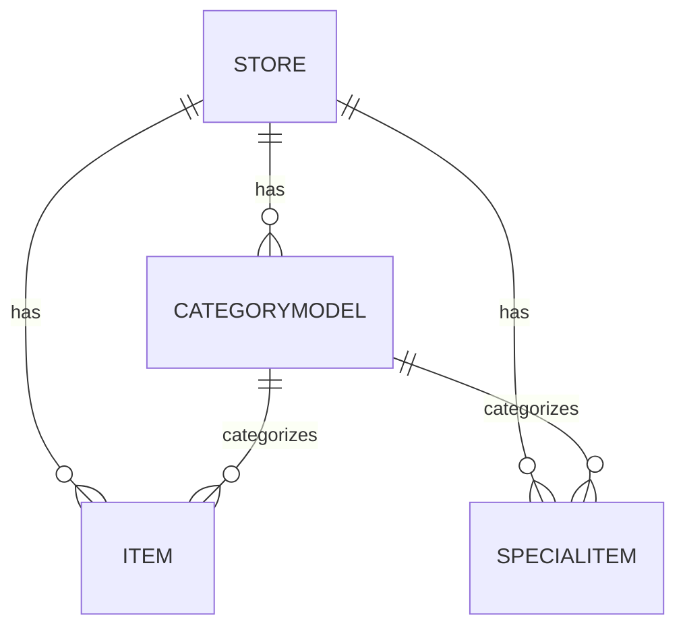

# Data Model & Prisma Schema

## Overview

Core entities:
- Store: Singleton (currently) holding branding, working hours, theme & font preferences, contact links.
- CategoryModel: Dynamic category definitions with display text & ordering.
- Item: Menu items referencing CategoryModel (optional until Phase 2 enforcement).
- SpecialItem: Time-bounded promotional items referencing CategoryModel.

## ER Diagram (Conceptual)



## Prisma Notes

Key considerations:
- `categoryId` kept optional during migration phase; Phase 2 will make it required and drop any leftover enum remnants.
- `workingHours` stored as JSON (array of day objects) for flexibility; indexable reporting can be added later with a separate schedule table if needed.
- Monetary fields (`price`, `prevPrice`) stored as numeric/decimal (depends on underlying DB mapping). Avoid float rounding issues by standardizing currency to JD for now.

## Field Semantics

| Model | Field | Meaning / Constraints |
|-------|-------|-----------------------|
| Store | brandColor | Hex value (e.g. `#DC2626`) controlling CSS variable injection |
| Store | themeMode | Enum-like string (`LIGHT` / `DARK`) used for `data-theme` attr |
| Store | fontStyle | (`CLASSIC` / `ELEGANT`) toggles font-family root attribute |
| Store | workingHours | JSON array of `{ day, open, close, closed? }` in local tz |
| CategoryModel | display | UI-facing Arabic name (unique per store ideally) |
| CategoryModel | order | Manual ordering; fallback secondary sort by createdAt |
| Item | available | Visibility toggle (not deleted) |
| Item | categoryId | Nullable until Phase 2, references CategoryModel |
| SpecialItem | dateFrom/dateTo | Inclusive time window for offer visibility |
| SpecialItem | prevPrice | Reference/original price for visual strike-through |

## Example Schema Fragment (Simplified)

```prisma
model CategoryModel {
  id          String   @id @default(cuid())
  storeId     String
  name        String   // internal slug-ish (normalized)
  display     String   // Arabic UI name
  order       Int      @default(0)
  items       Item[]
  specialItems SpecialItem[]
  createdAt   DateTime @default(now())
}

model Item {
  id          String   @id @default(cuid())
  storeId     String
  name        String
  description String?
  price       Float
  currency    String?  // 'JD'
  imageUrl    String
  available   Boolean  @default(true)
  categoryId  String?
  categoryRef CategoryModel? @relation(fields: [categoryId], references: [id])
  createdAt   DateTime @default(now())
}
```

## Indexing & Performance

Current queries are simple (per-store filtering). If category or item counts grow large:
- Add composite index `(storeId, categoryId)` on `Item` and `SpecialItem`.
- Add index on offer time window `(storeId, dateFrom, dateTo)` for active specials scanning.

## Phase 2 Migration Plan

1. Ensure all existing `Item` and `SpecialItem` rows have `categoryId` populated (backfill script in `categories-migration.md`).
2. Mark `categoryId` as required in schema.
3. Remove old enum field columns if they still exist (raw SQL `ALTER TABLE DROP COLUMN`).
4. Run `prisma migrate dev --name phase2_category_enforcement`.
5. Delete any transitional code branches.

## Backfill Script Sketch

```typescript
// scripts/backfill-category.ts
import { prisma } from "@/lib/prisma";

(async () => {
  const store = await prisma.store.findFirst();
  if (!store) return;
  const defaultCat = await prisma.categoryModel.upsert({
    where: { storeId_name: { storeId: store.id, name: "uncategorized" } },
    create: { storeId: store.id, name: "uncategorized", display: "متنوع", order: 999 },
    update: {},
  });
  await prisma.item.updateMany({ where: { storeId: store.id, categoryId: null }, data: { categoryId: defaultCat.id } });
  await prisma.specialItem.updateMany({ where: { storeId: store.id, categoryId: null }, data: { categoryId: defaultCat.id } });
})();
```

## Data Integrity Considerations

- Deleting a category is blocked if items or specials reference it (enforced in API layer). Hard constraint (FK) + ON DELETE RESTRICT can be introduced in Phase 2 for defense-in-depth.
- Offer date logic: API returns only offers whose `dateFrom <= now <= dateTo` when listing for public use; admin can still CRUD any dates.

## Future Schema Enhancements

| Feature | Change |
|---------|--------|
| Multi-store | Add `Tenant` + unique constraints including tenantId |
| Order capture | Add `Order`, `OrderLine`, and potential `Customer` models |
| Localization | Add `CategoryTranslation`, `ItemTranslation` tables |
| Price precision | Switch monetary fields to Decimal and add currency table |

---
Return to `apis.md` for endpoint-level contracts.
