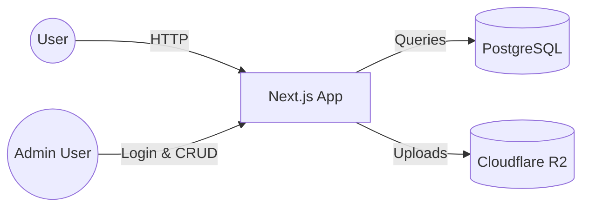
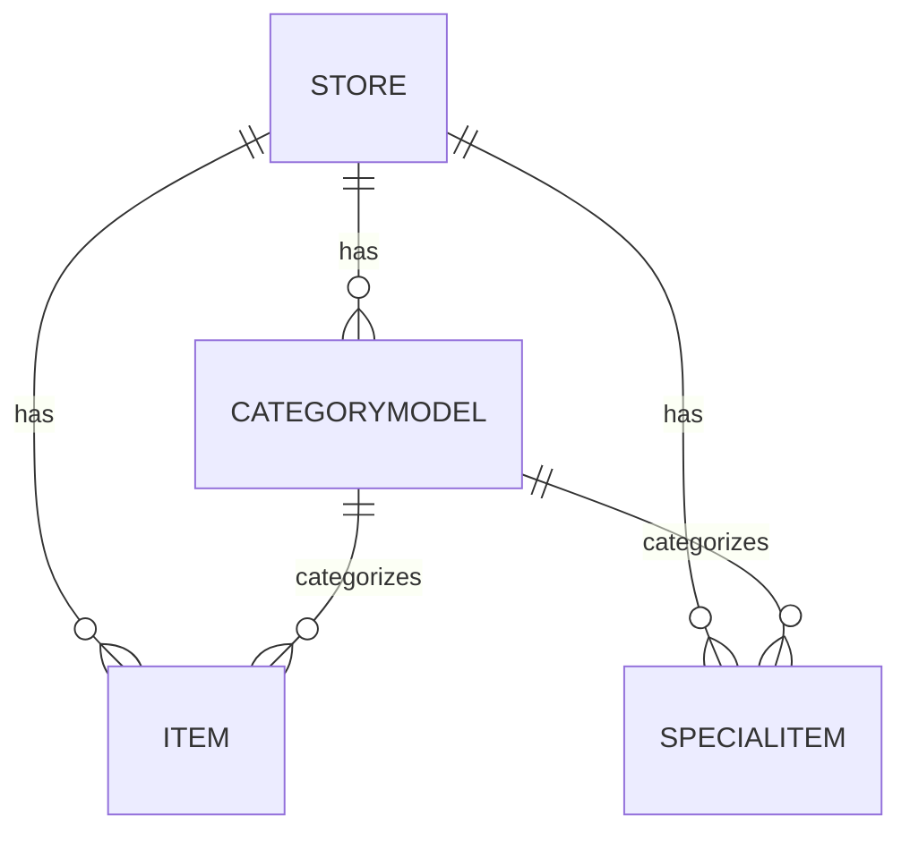
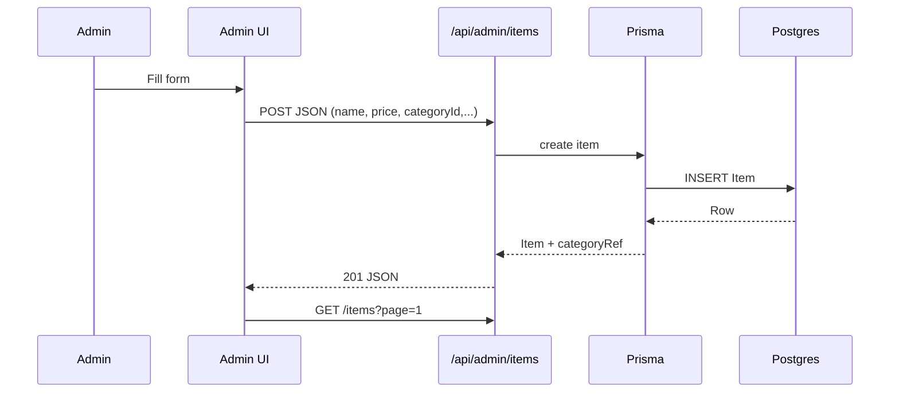
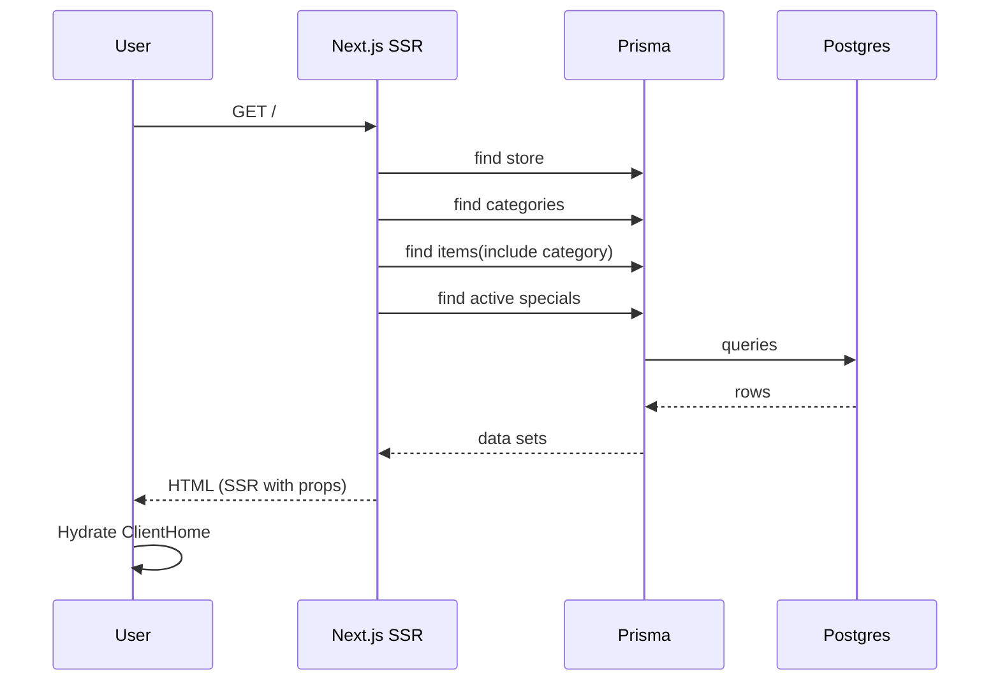
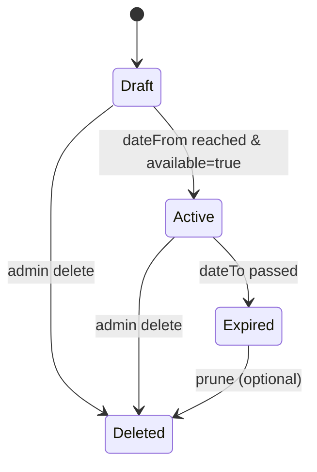
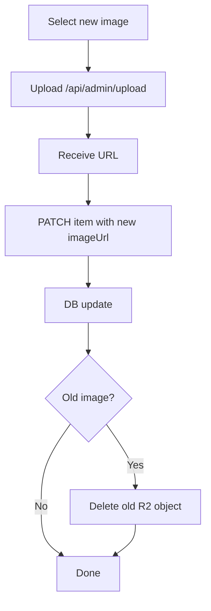
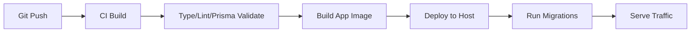
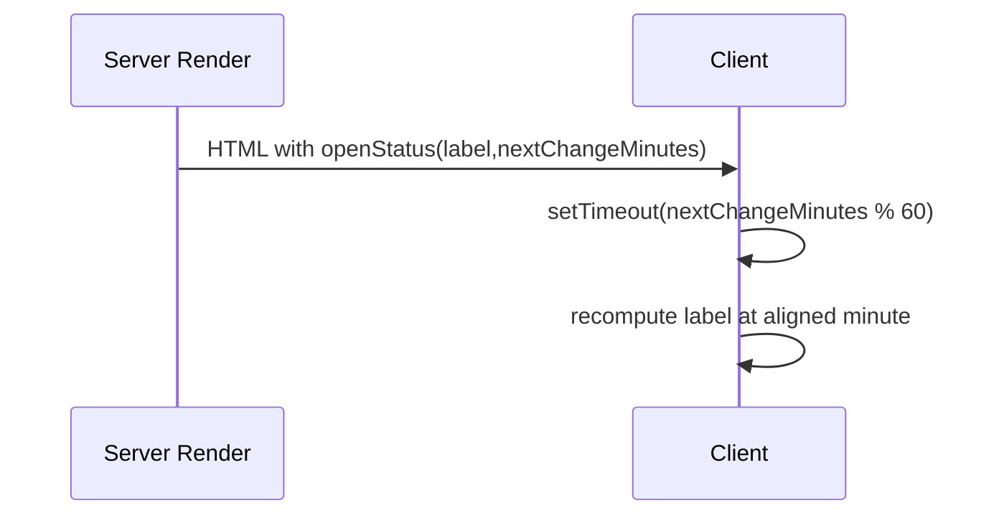

# UML & Diagrams (Text-Based)

> Diagrams are provided in Mermaid (preferred) for portability. Can be pasted into compatible renderers (e.g., MkDocs, GitHub, VS Code Mermaid preview).

## 1. Context Diagram


## 2. Container / Component Diagram
```mermaid
graph TD
  A[Next.js App Router]
  subgraph UI
    B[Server Components]
    C[Client Components]
  end
  subgraph API
    D[/api/admin/...]
  end
  subgraph Lib
    E[Auth]
    F[Working Hours]
    G[Links Fallback]
    H[R2 Wrapper]
  end
  I[Prisma Client] --> DB[(Postgres)]
  H --> R2[(R2 Bucket)]
  D --> I
  B --> I
  C --> D
  A --> B
  A --> C
```

## 3. Entity Relationship (Mermaid ER)


## 4. Sequence: Admin Creates Item


## 5. Sequence: Public Menu Load


## 6. State Diagram: Special Offer Lifecycle


## 7. Activity: Image Update


## 8. Deployment Pipeline (Conceptual)


## 9. Open Status Minute Refresh (Future)


---
Use these as a baseline; extend diagrams as new subsystems (orders, multi-tenant, etc.) are added.
